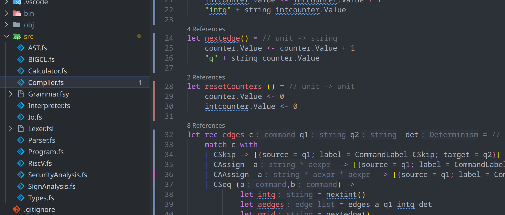
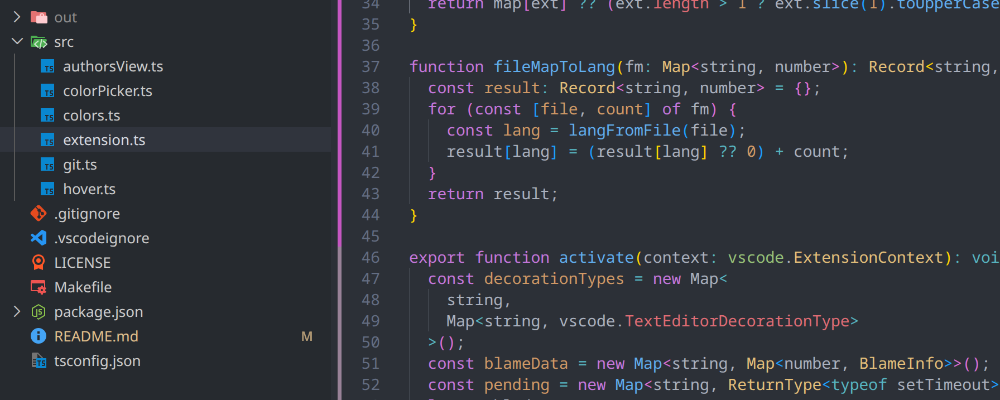
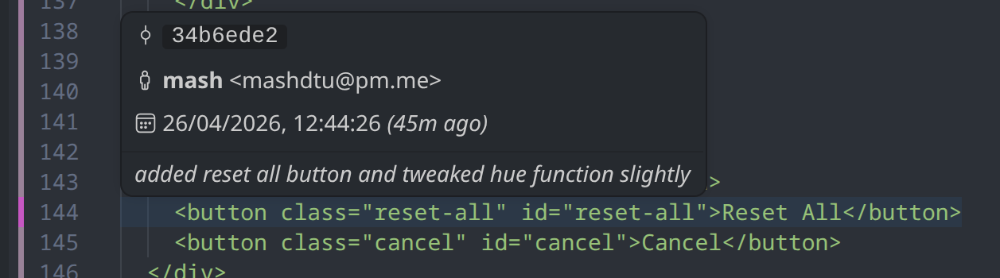
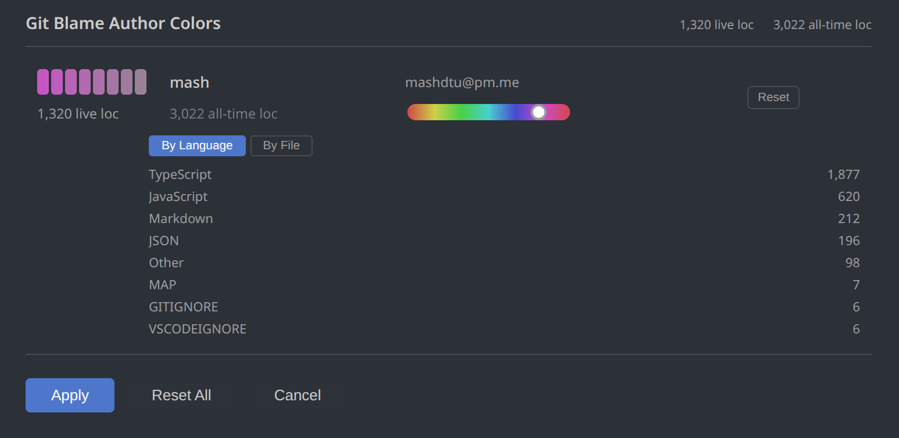

# Git Blame Colors

Visualize git blame directly in the editor gutter. Each line gets a colored block whose hue is tied to its author. Older commits fade toward grey so recent work stands out at a glance. Hover any line to see the full commit details.



## Features

### Gutter color blocks
A thin colored block appears in the gutter beside every line. The hue is unique per author and consistent across files. Commits fade toward grey as they age across 8 evenly-spaced saturation buckets.

| Bucket | Saturation multiplier |
|---|---|
| 1 (newest) | 100% |
| 2 | 89% |
| 3 | 77% |
| 4 | 66% |
| 5 | 54% |
| 6 | 43% |
| 7 | 31% |
| 8 (oldest) | 20% |

Saturation scales with the `gitBlameColors.saturation` setting. The minimum is always 10%.

The age window controls how much history is spread across the 8 buckets. By default it scales to the age of the oldest commit in the repo (`ageWindowDays = 0`). Anything older than the window is clamped to the lowest bucket.



### Hover for commit details
Hover over any line to see:
- Short commit hash
- Author name and email
- Commit date and relative time (e.g. *3d ago*)
- Commit summary message

If you have GitLens, git-graph, or githistory installed the extension defers hover to them to avoid duplication.



### Author color management
Open the **Show Authors** panel (`Git Blame Colors: Show Authors`) to see every contributor in the repository. Each row shows:
- 8 age-preview swatches showing how the author's color fades over time
- Author name and email
- **Live LOC**: lines currently attributed to this author across the whole repo (derived from `git blame`)
- **All-time LOC**: every line they ever added, including deleted ones (derived from `git log --numstat`)
- A hue slider to override the auto-generated hue
- A Reset button to revert to the auto-generated hue

Click **Apply** to save all hue changes, **Cancel** to discard.

#### LOC breakdown
Click any **Live LOC** or **All-time LOC** number — on a per-author row or on the header totals — to open a breakdown panel directly beneath it. The panel has two tabs:
- **By Language** — lines grouped by file extension (TypeScript, Python, etc.)
- **By File** — lines per file, sorted descending

The active cell is highlighted with a bottom border so you can see which metric is expanded. Click the same cell again to collapse the panel.




### Age window
Use **Git Blame Colors: Set Age Window** to set how many days of history are spread across the 8 color buckets. Set to `0` (default) to always scale to the age of the oldest commit in the repo.

### Toggle on/off
Quickly hide and show all blame decorations without reloading.

### Manual refresh
Force a re-run of git blame on the current file (useful after amending commits or rebasing).


## Commands

Open the Command Palette (`Ctrl+Shift+P` / `Cmd+Shift+P`) and search for:

| Command | Description |
|---|---|
| `Git Blame Colors: Toggle` | Show or hide all gutter blame blocks |
| `Git Blame Colors: Refresh` | Re-run blame on the current file |
| `Git Blame Colors: Show Authors` | Open the author color management panel |
| `Git Blame Colors: Set Age Window` | Set the age window in days (0 = scale to repo age) |


## Settings

| Setting | Default | Description |
|---|---|---|
| `gitBlameColors.saturation` | `50` | HSL saturation (0–100) applied to author colors |
| `gitBlameColors.lightness` | `56` | HSL lightness (0–100) applied to author colors |
| `gitBlameColors.ageWindowDays` | `0` | Days of history spread across the 8 age buckets. `0` scales to the oldest commit in the repo. If the repo is younger than the window, the window shrinks to fit. |
| `gitBlameColors.authorHues` | `{}` | Custom hue overrides per author email, e.g. `{"alice@example.com": 210}` |


## Requirements

- VS Code 1.74 or later
- Git must be available on `PATH`
- The file must be inside a git repository


## Installation

### From a VSIX file (all platforms)

This extension is not published to the VS Code Marketplace. Install it from the packaged `.vsix` file.

**Prerequisites:** Node.js 18+, npm, and `vsce`:
```sh
npm install -g @vscode/vsce
```

#### Option A - using the Makefile (Linux / macOS)

```sh
git clone https://github.com/mashdtu/vscode-blame-colors
cd vscode-blame-colors
npm install
make install
```

`make install` compiles the TypeScript, packages a `.vsix`, and installs it into VS Code in one step.

Other useful targets:

| Target | Description |
|---|---|
| `make compile` | Compile TypeScript only |
| `make watch` | Watch mode - recompile on save |
| `make package` | Build the `.vsix` without installing |
| `make release` | Bump patch version, package, tag, and publish a GitHub release |
| `make clean` | Remove `out/` and the `.vsix` |

#### Option B - manual steps (Linux / macOS / Windows)

```sh
git clone https://github.com/mashdtu/vscode-blame-colors
cd vscode-blame-colors
npm install
npm run compile
vsce package
```

Install the resulting `.vsix`:

**From the terminal:**
```sh
code --install-extension git-blame-colors-*.vsix
```

**From the VS Code UI:**
1. Open the Extensions view (`Ctrl+Shift+X`)
2. Click the `...` menu at the top right of the panel
3. Choose **Install from VSIX...**
4. Select the `.vsix` file

#### Windows (no Makefile)

The Makefile requires `make` (available via Git Bash, WSL, or `winget install GnuWin32.Make`). If you prefer plain PowerShell:

```sh
git clone https://github.com/mashdtu/vscode-blame-colors
cd vscode-blame-colors
npm install
npm run compile
vsce package
code --install-extension git-blame-colors-*.vsix
```


## Uninstalling

Open the Extensions view, find **Git Blame Colors**, click the gear icon, and choose **Uninstall**. Or from a terminal:

```sh
code --uninstall-extension mashdtu.git-blame-colors
```


## How it works

On activation (and whenever you switch files or save), the extension runs `git blame --porcelain` on the current file in a child process. It parses the output to extract per-line author, email, commit hash, timestamp, and summary. Each line is assigned a `TextEditorDecorationType` with an SVG gutter icon whose color is `hsl(<hue>, <saturation * age_multiplier>%, <lightness>%)`.

Age is bucketed relative to an age window anchored at the current time. If `ageWindowDays` is `0` the window stretches back to the oldest commit in the repo, so the full saturation range is always used. If a specific number of days is set, anything older than that window is clamped to minimum saturation.

The Show Authors panel runs `git diff --numstat` against the empty tree to enumerate all text files in the repo (binary files such as compiled artifacts and images are automatically excluded), then runs `git blame --line-porcelain` on each text file to compute live LOC per author. All-time LOC is computed with `git log --numstat --no-merges`.
